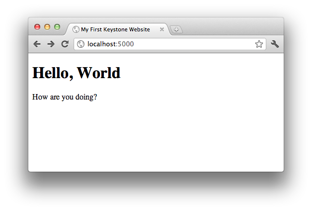
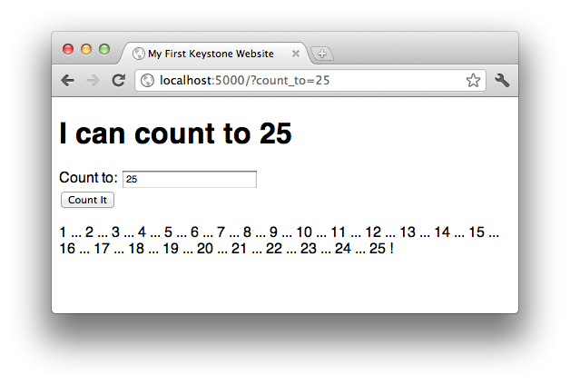

Learn Web Programming with Keystone
===================================

Keystone is, by design, incredibly easy to work with. This tutorial will
walk you through setting up Keystone for local development, teach you the
basics of Python web development and, by example, of HTML, and end with you
deploying your first application to a free web hosting service.

This tutorial is designed for those unfamiliar with web programming
concepts. If you've worked with web programming frameworks before, you may
be interested in :doc:`quickstart`, which only covers what's different about
Keystone.

Installing Keystone
-------------------

Keystone is a `Python <http://www.python.org/>`_ application, so you'll need
to have Python installed on your computer. The exact steps to do so will
depend on your operating system, and are documented on `the Python downloads
page <http://www.python.org/download/>`_. Keystone requires any release of
Python in the 2.x series (and suggests you use the latest 2.x release
available).

Once you have Python installed, open the Terminal (Windows users: use
"Command Prompt"), and install Keystone:

.. code-block:: bash

    $ easy_install Keystone

If you get a permission error, you may need to re-run the install command
using ``sudo``, which will prompt you for your password.

Even though you haven't yet begun to build your web site, you can actually
run Keystone using the ``keystone`` command, which will start a web server at
`http://localhost:5000/ <http://localhost:5000/>`_.

.. code-block:: bash

    $ keystone
     * Running on http://0.0.0.0:5000/
     * Restarting with reloader

Those two lines indicate that the web server has started and is waiting for
the first request. Each time your browser requests a page, the Keystone web
server will print a line that looks something like this:

.. code-block:: bash

    127.0.0.1 - - [22/Nov/2011 16:55:10] "GET / HTTP/1.1" 404 -

This shows, from left to right, the IP address of the computer that made the
request ("127.0.0.1" is a special value that indicates the computer you're
currently on), the date and time of the request, the request line (which
page the browser is asking for), and the status code of the response.
Normally we want to see a "200" status code, which indicates the request was
successfully served; in this case, "404" indicates that no page matching "/"
was found, which should not be surprising as we have not yet built any pages
for the web site.

But I digress; the fact that we can see these messages in the Terminal, and
that our browser gets a "Not found" message means that Keystone is working,
and we're ready to begin building websites.

The First Page
--------------

Keystone uses files on your computer's drive to store the contents of the
web site, so we'll need a place to work. I'll use the ``keystone`` directory
of my ``Documents`` directory, written as ``~/Documents/keystone``.

Inside that directory, I'll create my first web page in a file named
``index.ks``:

.. code-block:: html

    <!doctype html>
    <html>
        <head>
            <title>My First Keystone Website</title>
        </head>
        <body>
            <h1>Hello, World</h1>
            
How are you doing?

        </body>
    </html>

If you already know HTML, you'll recnogize this as a very basic HTML page.
If you don't, this might be a good time to `learn HTML5
<http://www.diveinto.org/html5/>`_. You'll probably be able to follow this
guide without being an expert, but some familiarity will help.

If you still have ``keystone`` running from before, you can kill it now by
hitting `Ctrl-C` (hold the "control" key and type "c") in the Terminal.
Navigate to the ``~/Documents/keystone`` and start ``keystone`` there:

.. code-block:: bash

    $ cd ~/Documents/keystone/
    ~/Documents/keystone/ $ keystone
     * Running on http://0.0.0.0:5000/
     * Restarting with reloader

Now go to `http://localhost:5000/ <http://localhost:5000/>`_ in your
browser, and you should see your page:

It's not very exciting so far, but we'll get there. First, let's add some
links and additional pages. Edit ``index.ks`` so that it looks like this:

.. code-block:: html

    <!doctype html>
    <html>
        <head>
            <title>My First Keystone Website</title>
            <link rel="stylesheet" href="/static/style.css"/>
        </head>
        <body>
            <h1>Hello, World</h1>
            
New! Check out <a href="/pageone">Page One</a>

        </body>
    </html>

which becomes:

.. image:: keystone-2-index.png

And then create ``pageone.ks``:

.. code-block:: html

    <!doctype html>
    <html>
        <head>
            <title>Page One</title>
            <link rel="stylesheet" href="/static/style.css"/>
        </head>
        <body>
            <h1>This is Page One</h1>
            
Would you like to <a href="/">return home</a>

        </body>
    </html>

which becomes:

.. image:: keystone-2-pageone.png

and ``static/style.css`` (you will need to create the
``~/Documents/keystone/static/`` folder for this file):

.. code-block:: css

    * {
      font-family:sans-serif;
    }

    a, a:visited {
      color:red;
    }

As you can see, there's a simple mapping between filenames and the URLs that
your web pages are accessed at: to convert from a filename to a URL, drop
the ".ks" file extension, with the special-case that "index.ks" is
accessible at both its normal URL (``/index``) and the directory root for
the directory it appears in (``/``). To convert from a URL to a file, take
the URL path (everything after the ``http://server.com/``), and add the
".ks" file extension. Web requests for static files (like
``/static/style.css``) are served directly if the file exists.

You may also have noticed (and it bears pointing out anyway) that when you
change a file, Keystone notices this and renders the new version
immediately. Thus, under normal circumstances, there's no need to restart
``keystone`` during development of your web site.

Make It Dynamic
---------------

So far, we haven't done anything that wouldn't be possible with pure HTML
files, but Keystone offers a whole lot more flexibility than that. One thing
you may have noticed above is that there is a lot of repetition between the
two HTML files. Imagine a site with hundreds of pages. Would you want to
type all of that boilerplate HTML each time?

Fortunately, Keystone's templating language, `Jinja
<http://jinja.pocoo.org/>`_, offers a better solution, through "template
inheritance". We will create a template which holds the structure of our
page, and define replaceable "blocks" within the template where individual
pages can insert their content.

Create ``_base.html`` with the following content:

.. code-block:: jinja

    <!doctype html>
    <html>
        <head>
            <title></title>
            <link rel="stylesheet" href="/static/style.css"/>
        </head>
        <body>
            
        </body>
    </html>

Now we can simplify our individual pages considerably. Here's ``index.ks``:

.. code-block:: jinja

    

    My First Keystone Website

    
        <h1>Hello, World</h1>
        
New! Check out <a href="/pageone">Page One</a>
    

and ``pageone.ks``:

.. code-block:: jinja

    

    Page One

    
        <h1>This is Page One</h1>
        
Would you like to <a href="/">return home</a>

    

OK, in this very simple exmaple, we haven't actually saved very much code,
if any, but you can imagine that if ``_base.html`` were very long, and
defined common elements present on all pages (like navigation, header and
footer messages, included javascript and CSS, etc), that this would help.
Additionally, if we want to radically change the design of our site, we now
have only one file to do it in, rather than needing to replicate our changes
to each page.

More importantly, you can see now that this is more powerful than a simple
static web site. The HTML that is returned to the browser by these new
versions of the pages is effectively identical to what we had before; but it
is dynamically assembled by Keystone, in order to help save you development
time.

Jinja also allows parameterizing particular bits of text within the page,
through variable substitution. Replace ``index.ks`` with the following:

.. code-block:: jinja

    import random
    name = random.choice(['World', 'Friend'])
    ----
    

    My First Keystone Website

    
        <h1>Hello, {{name}}</h1>
        
New! Check out <a href="/pageone">Page One</a>

    

Open `http://localhost:5000/ <http://localhost:5000/>`_ in your browser, and
refresh a few times. You should see the greeting vary between "Hello, World"
and "Hello, Friend" depending on which of the two was chosen at random.

So what's happening here? We've added a section of Python code to our page
(everything before the "``----``"), which is executed by Keystone before the
page is rendered. This code assigns either "World" or "Friend" at random to
the ``name`` variable. When the template is rendered, the ``{{name}}`` token
is replaced by the value assigned to the ``name`` variable in the Python
section.

You can do much more than randomly choose a word in the Python section of a
Keystone page -- anything which is possible in Python (which is,
essentially, anything) can be done in a a Keystone page, and all the
variables defined in the Python section become available for use within the
template section. Here's another example:

.. code-block:: jinja

    import random
    count_to = random.randint(5, 15)
    numbers = range(1, count_to + 1)
    ----
    

    My First Keystone Website

    
        <h1>I can count to {{count_to}}</h1>
        

          
            {{number}}
             ... 
          !
        

    

.. image:: keystone-3-counting.png

Of course, since we've chosen a number to count to at random, you'll see a
different count each time you refresh the page.

Reacting to the Web
-------------------

Substituting random variables into your templates isn't the most exciting
(or useful) web programming technique, though it's charming in its own way.
In most cases, we want web sites to react to input from the site's visitors
in some meaningful way.

Building on the last example, we can create a page which counts up to a
user-supplied number. (Python is very good at counting, as it turns out). To
do so, we'll need some way to get input from a user, and use that to
determine the behavior of the web page. Enter the query string.

The query string is a set of parameters that can be passed to a web page by
way of the URL by adding a ``?`` to the end of the URL, and a series of
parameter names and values separated by ``=``. Multiple parameter name/value
pairs are separated by an ``&``, so a complete URL with query string looks
like ``http://www.exmaple.com/?first_name=Dan&last_name=Crosta``.

In Keystone, you can access query string parameters with the
``request.values`` object (this object, and many other :doc:`viewvars` are
available by default in the Python portion of your page, as if by magic):

.. code-block:: jinja

    if 'count_to' in request.values:
        count_to = request.values.get('count_to')
        count_to = int(count_to)
    else:
        count_to = 10
    numbers = range(1, count_to + 1)
    ----
    

    My First Keystone Website

    
        <h1>I can count to {{count_to}}</h1>
        

          
            {{number}}
             ... 
          !
        

    

First we check if the query string parameter "count_to" [#str]_ exists
for this request (it might not, if the viewer didn't click a link containing
the query string, or if they did not type it by hand), and if it does, we
set the variable ``count_to`` to have that value. After that, we convert the
value to an integer (since integers are easy to count with), and move on
with the rest of the page as before.

However, if there is no "count_to" query string parameter, the test in the
line ``if 'count_to' in request.values:`` will fail, and the program will pick
up in the ``else:`` block, and set a default value of 10 to count to. Since
"``10``" is the syntax for expressing an integer in Python, we don't need to
convert it to an integer (as it already is one, and the conversion would do
nothing).

Try experimenting with a few different values for the ``count_to`` query
string parameter. Try counting to 100, and 1000. Try counting to one million
(this might take a little while -- how long would it take you?)

Now try counting to `Bob <http://localhost:5000/?count_to=Bob>`_. You should
see something like this:

.. image:: keystone-bob.png

Congratulations, you've made your first `bug
<http://en.wikipedia.org/wiki/Software_bug>`_! It turns out Python doesn't
know how to count to Bob (and neither do I, for that matter), but if you
learn to read this output, it will point you to your error, which helps
tremendously in the web development process. Just below the big "ValueError"
heading is the exact error message: "Bob" is not a valid integer (well, we
knew that).

When programming for the web, especially when dealing with user input, it's
best to "program defensively," that is, to make sure that you don't trust
user input unless you've checked it first. In our case, we can use the
``isdigit`` method of strings (which returns ``True`` if the string consists
only of characters that represent digits, and ``False`` otherwise) to see if
it can be a valid number or not:

.. code-block:: jinja

    if 'count_to' in request.values:
        count_to = request.values.get('count_to')
        if count_to.isdigit():
            count_to = int(count_to)
        else:
            count_to = 10
    else:
        count_to = 10
    numbers = range(1, count_to + 1)
    ----
    

    My First Keystone Website

    
        <h1>I can count to {{count_to}}</h1>
        

          
            {{number}}
             ... 
          !
        

    

Now, no matter what value a user supplies for the ``count_to`` query string
parameter, we know that our code will only try to count to it if it's an
integer (and in all other cases it will simply count to 10).

Manually typing in query string parameters does get rather tiresome, though,
and it might be too much to ask of your visitors (they might simply decide
not to use your site any more). Instead, we can present an HTML form to our
users, and ask them to fill it out, resulting in a far better user
experience. Continuing to build out ``index.ks``, let's add a form:

.. code-block:: jinja

    if 'count_to' in request.values:
        count_to = request.values.get('count_to')
        if count_to.isdigit():
            count_to = int(count_to)
        else:
            count_to = 10
    else:
        count_to = 10
    numbers = range(1, count_to + 1)
    ----
    

    My First Keystone Website

    
        <h1>I can count to {{count_to}}</h1>
        <form>
            Count to:
            <input type="text" name="count_to" value="{{count_to}}"/>
            <input type="submit" value="Count It"/>
        </form>
        

          
            {{number}}
             ... 
          !
        

    

(Recall that the ``{{count_to}}`` syntax means "put the value of the
``count_to`` variable here in the HTML".)

Fill out the form, click the "Count It" button, and see what happens:

By default, form submissions go to the same page as you are currently on,
and store the input field values in the query string. This works well for
small forms, or forms without sensitive data (since query strings are part
of the URL and are logged by most web servers), but in many cases you will
want to use a "POST" request, which sends the form data along side the URL,
but not actually in it. You can do this by replacing "``<form>``" with
"``<form method="POST">``" in the template.

.. code-block:: jinja

    if 'count_to' in request.values:
        count_to = request.values.get('count_to')
        if count_to.isdigit():
            count_to = int(count_to)
        else:
            count_to = 10
    else:
        count_to = 10
    numbers = range(1, count_to + 1)
    ----
    

    My First Keystone Website

    
        <h1>I can count to {{count_to}}</h1>
        <form method="POST">
            Count to:
            <input type="text" name="count_to" value="{{count_to}}"/>
            <input type="submit" value="Count It"/>
        </form>
        

          
            {{number}}
             ... 
          !
        

    

You can now load `http://localhost:5000/ <http://localhost:5000/>`_ (that
is, without any query string parameters), fill out the form, and submit.

One annoyance you may notice is that if you attempt to refresh the browser
after submitting a POST request, you will get a warning message asking you
whether it's OK to submit data again. The reasons behind this message are
partly historical, partly practical, and entirely likely to start flame wars
between web developers, and are best not addressed here. Regardless of your
stance on the philosophical issues behind this debate, the agreed-upon best
behavior is to receive a POST request, do some appropriate processing, and
then redirect the user's browser to a new page (this new page will be
accessed with a normal GET request, which does not trigger the browser
warning).

In order to use this method in our counting example, we could redirect from
the POST to a page using GET and the query string, but the point of using a
POST request in the first place was to avoid the query string. Instead,
we'll create a page whose name itself is a parameter. To do so, create
``~/Documents/keystone/count/%count_to.ks``. The "%" at the start of the
filename indicates to Keystone that this page should match any URL request
which gets to it -- in other words, ``http://localhost:5000/count/25``,
``http://localhost:5000/count/100``, and even
``http://localhost:5000/count/Bob`` will all match. Inside ``%count_to.ks``,
the variable ``count_to`` will contain the (string) URL segment that
matched (following the previous examples, "25", "100", and "Bob",
respectively).

First, update ``index.ks`` to the following:

.. code-block:: jinja

    if 'count_to' in request.values:
        count_to = request.values.get('count_to')
        raise http.SeeOther('/count/' + count_to)
    ----
    

    My First Keystone Website

    
        <h1>How high can you count?</h1>
        <form method="POST">
            Count to:
            <input type="text" name="count_to"/>
             
            <input type="submit" value="Count It"/>
        </form>
    

This is similar to what ``index.ks`` contained before, but rather than
doing any counting, it simply generates the URL (e.g. "``/count/100``"), and
sends a "SeeOther" (i.e. a redirect) message back to the browser. The
``raise`` statement here breaks the usual flow of processing the Python code
then rendering the template, so that Keystone knows to send a redirect
message to the user's browser.

Next, make ``%count_to.ks`` contain the following:

.. code-block:: jinja

    if count_to.isdigit():
        count_to = int(count_to)
    else:
        count_to = 10
    numbers = range(1, count_to + 1)
    ----
    

    My First Keystone Website

    
        <h1>I can count to {{count_to}}</h1>
        

          
            {{number}}
             ... 
          !
        

        
<a href="/">Count again</a>

    

Rembmer that the ``count_to`` variable is set based on the name of the
file; if you had named the file ``max_number.ks``, then the variable
``count_to`` would have to be updated to be ``max_number`` in the Python
section of this file. As before, we have to convert it from a string to an
integer, and have a default value on hand in case it cannot be converted.

Congratulations!
----------------

That's it! You're now a web programmer! This may not be the most impressive
web application ever designed, but, hey, everyone's got to start somewhere.
The important thing is that you now have a grasp of some of the fundamental
concepts and tools with which to build more complex web applications that do
more interesting things.

.. rubric:: Footnotes

.. [#str] When some text appears inside single or double quotation marks in
   Python, we call that text a "string" as in "a string of letters" (often
   called characters). You can think of it as a word or phrase, as that's
   often the sort of thing we'll use strings for. Other common Python
   variable types to use are integers (usually referred to as ints), which
   store whole numbers; fractional numbers known as "floats", like 3.14159;
   and booleans or "bools", which store either ``True`` or ``False``.

