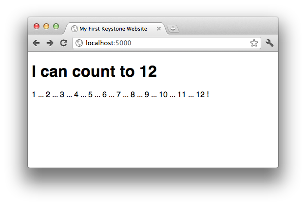

Make It Dynamic
===============

So far, we haven't done anything that wouldn't be possible with pure HTML
files, but Keystone offers a whole lot more flexibility than that. One thing
you may have noticed above is that there is a lot of repetition between the
two HTML files. Imagine a site with hundreds of pages. Would you want to
type all of that boilerplate HTML each time?

Fortunately, Keystone's templating language, `Jinja
<http://jinja.pocoo.org/>`_, offers a better solution, through "template
inheritance". We will create a template which holds the structure of our
page, and define replaceable "blocks" within the template where individual
pages can insert their content.

Create ``_base.html`` with the following content:

.. code-block:: keystone

    <!doctype html>
    <html>
        <head>
            <title></title>
            <link rel="stylesheet" href="/static/style.css"/>
        </head>
        <body>
            
        </body>
    </html>

Now we can simplify our individual pages considerably. Here's ``index.ks``:

.. code-block:: keystone

    

    My First Keystone Website

    
        <h1>Hello, World</h1>
        
New! Check out <a href="/pageone">Page One</a>
    

and ``pageone.ks``:

.. code-block:: keystone

    

    Page One

    
        <h1>This is Page One</h1>
        
Would you like to <a href="/">return home</a>

    

OK, in this very simple exmaple, we haven't actually saved very much code,
if any, but you can imagine that if ``_base.html`` were very long, and
defined common elements present on all pages (like navigation, header and
footer messages, included javascript and CSS, etc), that this would help.
Additionally, if we want to radically change the design of our site, we now
have only one file to do it in, rather than needing to replicate our changes
to each page.

More importantly, you can see now that this is more powerful than a simple
static web site. The HTML that is returned to the browser by these new
versions of the pages is effectively identical to what we had before; but it
is dynamically assembled by Keystone, in order to help save you development
time.

Jinja also allows parameterizing particular bits of text within the page,
through variable substitution. Replace ``index.ks`` with the following:

.. code-block:: keystone

    import random
    name = random.choice(['World', 'Friend'])
    ----
    

    My First Keystone Website

    
        <h1>Hello, {{name}}</h1>
        
New! Check out <a href="/pageone">Page One</a>

    

Open `http://localhost:5000/ <http://localhost:5000/>`_ in your browser, and
refresh a few times. You should see the greeting vary between "Hello, World"
and "Hello, Friend" depending on which of the two was chosen at random.

So what's happening here? We've added a section of Python code to our page
(everything before the "``----``"), which is executed by Keystone before the
page is rendered. This code assigns either "World" or "Friend" at random to
the ``name`` variable. When the template is rendered, the ``{{name}}`` token
is replaced by the value assigned to the ``name`` variable in the Python
section.

You can do much more than randomly choose a word in the Python section of a
Keystone page -- anything which is possible in Python (which is,
essentially, anything) can be done in a a Keystone page, and all the
variables defined in the Python section become available for use within the
template section. Here's another example:

.. code-block:: keystone

    import random
    count_to = random.randint(5, 15)
    numbers = range(1, count_to + 1)
    ----
    

    My First Keystone Website

    
        <h1>I can count to {{count_to}}</h1>
        

          
            {{number}}
             ... 
          !
        

    

Of course, since we've chosen a number to count to at random, you'll see a
different count each time you refresh the page.

