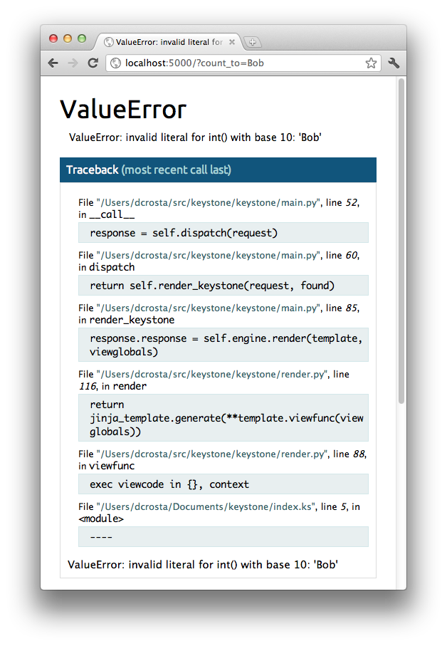

Reacting to the Web
===================

Substituting random variables into your templates isn't the most exciting
(or useful) web programming technique, though it's charming in its own way.
In most cases, we want web sites to react to input from the site's visitors
in some meaningful way.

Building on the last example, we can create a page which counts up to a
user-supplied number. (Python is very good at counting, as it turns out). To
do so, we'll need some way to get input from a user, and use that to
determine the behavior of the web page. Enter the query string.

The query string is a set of parameters that can be passed to a web page by
way of the URL by adding a ``?`` to the end of the URL, and a series of
parameter names and values separated by ``=``. Multiple parameter name/value
pairs are separated by an ``&``, so a complete URL with query string looks
like ``http://www.exmaple.com/?first_name=Dan&last_name=Crosta``.

In Keystone, you can access query string parameters with the
``request.values`` object (this object, and many other :doc:`/view-variables` are
available by default in the Python portion of your page, as if by magic):

.. code-block:: keystone

    if 'count_to' in request.values:
        count_to = request.values.get('count_to')
        count_to = int(count_to)
    else:
        count_to = 10
    numbers = range(1, count_to + 1)
    ----
    

    My First Keystone Website

    
        <h1>I can count to {{count_to}}</h1>
        

          
            {{number}}
             ... 
          !
        

    

First we check if the query string parameter "count_to" exists for this
request (it might not, if the viewer didn't click a link containing the
query string, or if they did not type it by hand), and if it does, we set
the variable ``count_to`` to have that value. After that, we convert the
value to an integer (since integers are easy to count with), and move on
with the rest of the page as before.

However, if there is no "count_to" query string parameter, the test in the
line ``if 'count_to' in request.values:`` will fail, and the program will pick
up in the ``else:`` block, and set a default value of 10 to count to. Since
"``10``" is the syntax for expressing an integer in Python, we don't need to
convert it to an integer (as it already is one, and the conversion would do
nothing).

Try experimenting with a few different values for the ``count_to`` query
string parameter. Try counting to 100, and 1000. Try counting to one million
(this might take a little while -- how long would it take you?)

Now try counting to `Bob <http://localhost:5000/?count_to=Bob>`_. You should
see something like this:

Congratulations, you've made your first `bug
<http://en.wikipedia.org/wiki/Software_bug>`_! It turns out Python doesn't
know how to count to Bob (and neither do I, for that matter), but if you
learn to read this output, it will point you to your error, which helps
tremendously in the web development process. Just below the big "ValueError"
heading is the exact error message: "Bob" is not a valid integer (well, we
knew that).

When programming for the web, especially when dealing with user input, it's
best to "program defensively," that is, to make sure that you don't trust
user input unless you've checked it first. In our case, we can use the
``isdigit`` method of strings (which returns ``True`` if the string consists
only of characters that represent digits, and ``False`` otherwise) to see if
it can be a valid number or not:

.. code-block:: keystone

    if 'count_to' in request.values:
        count_to = request.values.get('count_to')
        if count_to.isdigit():
            count_to = int(count_to)
        else:
            count_to = 10
    else:
        count_to = 10
    numbers = range(1, count_to + 1)
    ----
    

    My First Keystone Website

    
        <h1>I can count to {{count_to}}</h1>
        

          
            {{number}}
             ... 
          !
        

    

Now, no matter what value a user supplies for the ``count_to`` query string
parameter, we know that our code will only try to count to it if it's an
integer (and in all other cases it will simply count to 10).

Manually typing in query string parameters does get rather tiresome, though,
and it might be too much to ask of your visitors (they might simply decide
not to use your site any more). Instead, we can present an HTML form to our
users, and ask them to fill it out, resulting in a far better user
experience. Continuing to build out ``index.ks``, let's add a form:

.. code-block:: keystone

    if 'count_to' in request.values:
        count_to = request.values.get('count_to')
        if count_to.isdigit():
            count_to = int(count_to)
        else:
            count_to = 10
    else:
        count_to = 10
    numbers = range(1, count_to + 1)
    ----
    

    My First Keystone Website

    
        <h1>I can count to {{count_to}}</h1>
        <form>
            Count to:
            <input type="text" name="count_to" value="{{count_to}}"/>
            <input type="submit" value="Count It"/>
        </form>
        

          
            {{number}}
             ... 
          !
        

    

(Recall that the ``{{count_to}}`` syntax means "put the value of the
``count_to`` variable here in the HTML".)

Fill out the form, click the "Count It" button, and see what happens:

.. image:: keystone-count-form.png

By default, form submissions go to the same page as you are currently on,
and store the input field values in the query string. This works well for
small forms, or forms without sensitive data (since query strings are part
of the URL and are logged by most web servers), but in many cases you will
want to use a "POST" request, which sends the form data along side the URL,
but not actually in it. You can do this by replacing "``<form>``" with
"``<form method="POST">``" in the template.

.. code-block:: keystone

    if 'count_to' in request.values:
        count_to = request.values.get('count_to')
        if count_to.isdigit():
            count_to = int(count_to)
        else:
            count_to = 10
    else:
        count_to = 10
    numbers = range(1, count_to + 1)
    ----
    

    My First Keystone Website

    
        <h1>I can count to {{count_to}}</h1>
        <form method="POST">
            Count to:
            <input type="text" name="count_to" value="{{count_to}}"/>
            <input type="submit" value="Count It"/>
        </form>
        

          
            {{number}}
             ... 
          !
        

    

You can now load `http://localhost:5000/ <http://localhost:5000/>`_ (that
is, without any query string parameters), fill out the form, and submit.

One annoyance you may notice is that if you attempt to refresh the browser
after submitting a POST request, you will get a warning message asking you
whether it's OK to submit data again. The reasons behind this message are
partly historical, partly practical, and entirely likely to start flame wars
between web developers, and are best not addressed here. Regardless of your
stance on the philosophical issues behind this debate, the agreed-upon best
behavior is to receive a POST request, do some appropriate processing, and
then redirect the user's browser to a new page (this new page will be
accessed with a normal GET request, which does not trigger the browser
warning).

In order to use this method in our counting example, we could redirect from
the POST to a page using GET and the query string, but the point of using a
POST request in the first place was to avoid the query string. Instead,
we'll create a page whose name itself is a parameter. To do so, create
``~/Documents/keystone/count/%count_to.ks``. The "%" at the start of the
filename indicates to Keystone that this page should match any URL request
which gets to it -- in other words, ``http://localhost:5000/count/25``,
``http://localhost:5000/count/100``, and even
``http://localhost:5000/count/Bob`` will all match. Inside ``%count_to.ks``,
the variable ``count_to`` will contain the (string) URL segment that
matched (following the previous examples, "25", "100", and "Bob",
respectively).

First, update ``index.ks`` to the following:

.. code-block:: keystone

    if 'count_to' in request.values:
        count_to = request.values.get('count_to')
        raise http.SeeOther('/count/' + count_to)
    ----
    

    My First Keystone Website

    
        <h1>How high can you count?</h1>
        <form method="POST">
            Count to:
            <input type="text" name="count_to"/>
             
            <input type="submit" value="Count It"/>
        </form>
    

This is similar to what ``index.ks`` contained before, but rather than
doing any counting, it simply generates the URL (e.g. "``/count/100``"), and
sends a "SeeOther" (i.e. a redirect) message back to the browser. The
``raise`` statement here breaks the usual flow of processing the Python code
then rendering the template, so that Keystone knows to send a redirect
message to the user's browser.

Next, make ``%count_to.ks`` contain the following:

.. code-block:: keystone

    if count_to.isdigit():
        count_to = int(count_to)
    else:
        count_to = 10
    numbers = range(1, count_to + 1)
    ----
    

    My First Keystone Website

    
        <h1>I can count to {{count_to}}</h1>
        

          
            {{number}}
             ... 
          !
        

        
<a href="/">Count again</a>

    

Rembmer that the ``count_to`` variable is set based on the name of the
file; if you had named the file ``max_number.ks``, then the variable
``count_to`` would have to be updated to be ``max_number`` in the Python
section of this file. As before, we have to convert it from a string to an
integer, and have a default value on hand in case it cannot be converted.

