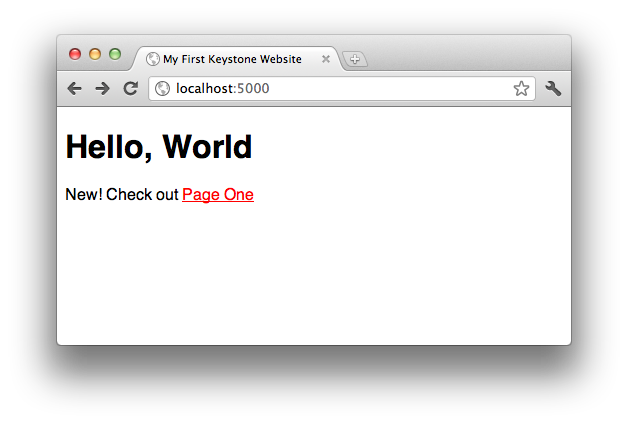

The First Page
==============

Keystone uses files on your computer's drive to store the contents of the
web site, so we'll need a place to work. I'll use the ``keystone`` directory
of my ``Documents`` directory, written as ``~/Documents/keystone``.

Inside that directory, I'll create my first web page in a file named
``index.ks``:

.. code-block:: keystone

    <!doctype html>
    <html>
        <head>
            <title>My First Keystone Website</title>
        </head>
        <body>
            <h1>Hello, World</h1>
            
How are you doing?

        </body>
    </html>

If you already know HTML, you'll recnogize this as a very basic HTML page.
If you don't, this might be a good time to `learn HTML5
<http://www.diveinto.org/html5/>`_. You'll probably be able to follow this
guide without being an expert, but some familiarity will help.

If you still have ``keystone`` running from before, you can kill it now by
hitting `Ctrl-C` (hold the "control" key and type "c") in the Terminal.
Navigate to the ``~/Documents/keystone`` and start ``keystone`` there:

.. code-block:: bash

    $ cd ~/Documents/keystone/
    ~/Documents/keystone/ $ keystone
     * Running on http://0.0.0.0:5000/
     * Restarting with reloader

Now go to `http://localhost:5000/ <http://localhost:5000/>`_ in your
browser, and you should see your page:

.. image:: keystone-1-index.png

It's not very exciting so far, but we'll get there. First, let's add some
links and additional pages. Edit ``index.ks`` so that it looks like this:

.. code-block:: keystone

    <!doctype html>
    <html>
        <head>
            <title>My First Keystone Website</title>
            <link rel="stylesheet" href="/static/style.css"/>
        </head>
        <body>
            <h1>Hello, World</h1>
            
New! Check out <a href="/pageone">Page One</a>

        </body>
    </html>

which becomes:

And then create ``pageone.ks``:

.. code-block:: keystone

    <!doctype html>
    <html>
        <head>
            <title>Page One</title>
            <link rel="stylesheet" href="/static/style.css"/>
        </head>
        <body>
            <h1>This is Page One</h1>
            
Would you like to <a href="/">return home</a>

        </body>
    </html>

which becomes:

.. image:: keystone-2-pageone.png

and ``static/style.css`` (you will need to create the
``~/Documents/keystone/static/`` folder for this file):

.. code-block:: css

    * {
      font-family:sans-serif;
    }

    a, a:visited {
      color:red;
    }

As you can see, there's a simple mapping between filenames and the URLs that
your web pages are accessed at: to convert from a filename to a URL, drop
the ".ks" file extension, with the special-case that "index.ks" is
accessible at both its normal URL (``/index``) and the directory root for
the directory it appears in (``/``). To convert from a URL to a file, take
the URL path (everything after the ``http://server.com/``), and add the
".ks" file extension. Web requests for static files (like
``/static/style.css``) are served directly if the file exists.

You may also have noticed (and it bears pointing out anyway) that when you
change a file, Keystone notices this and renders the new version
immediately. Thus, under normal circumstances, there's no need to restart
``keystone`` during development of your web site.

